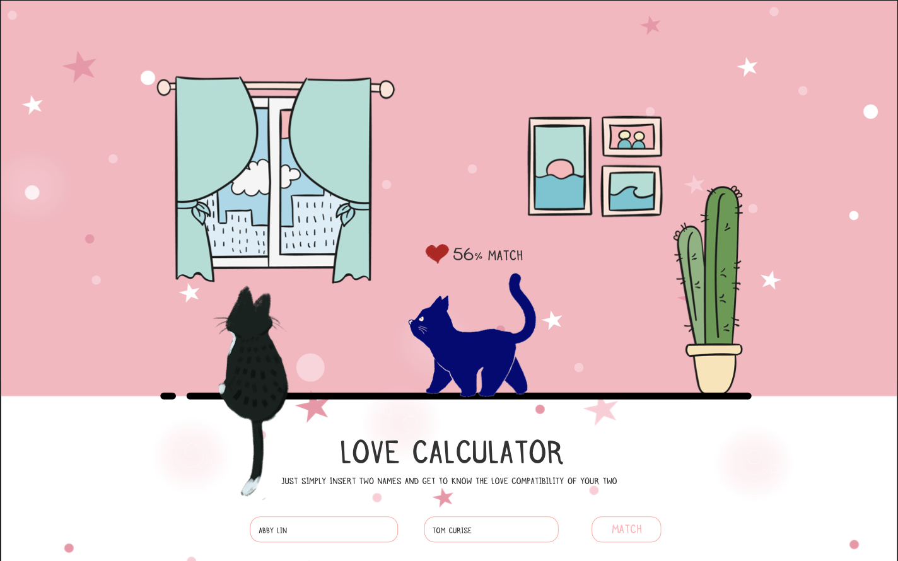
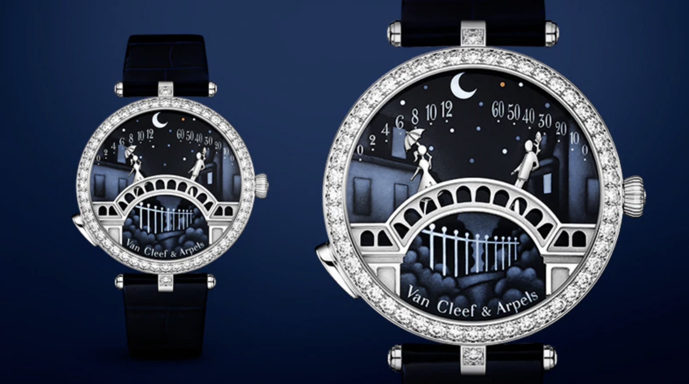
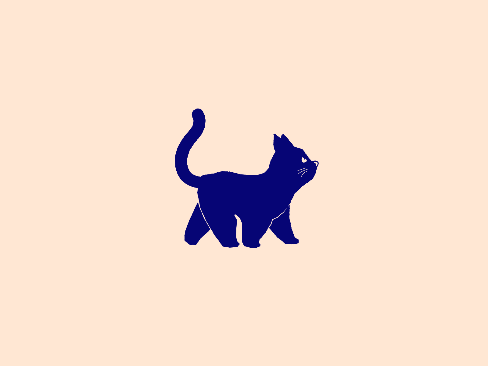
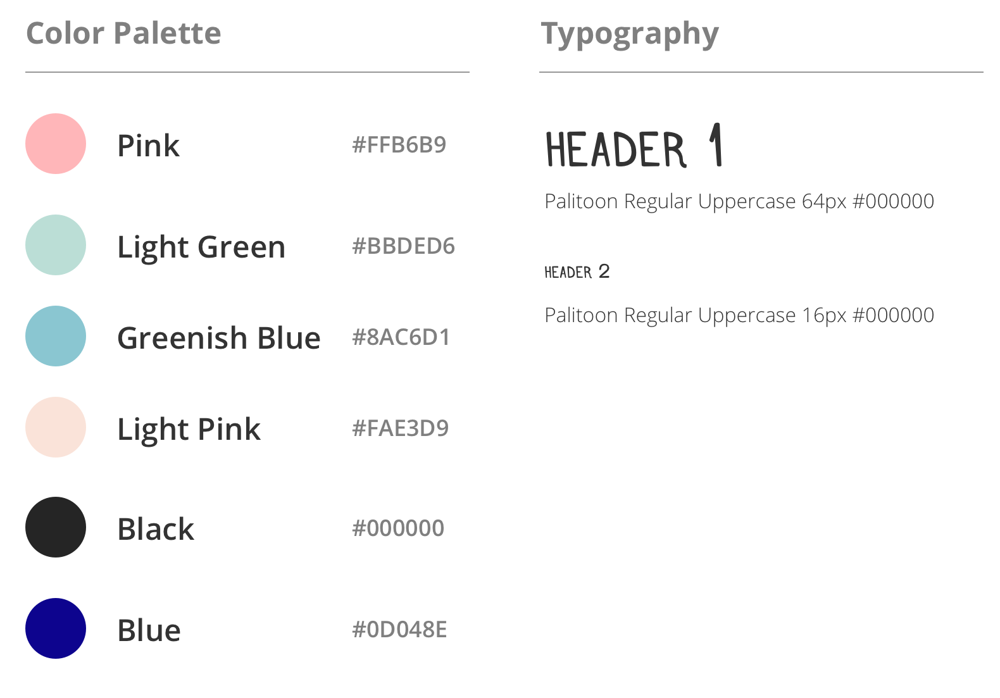
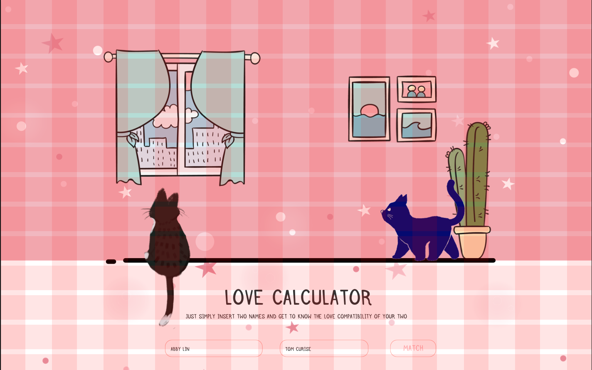
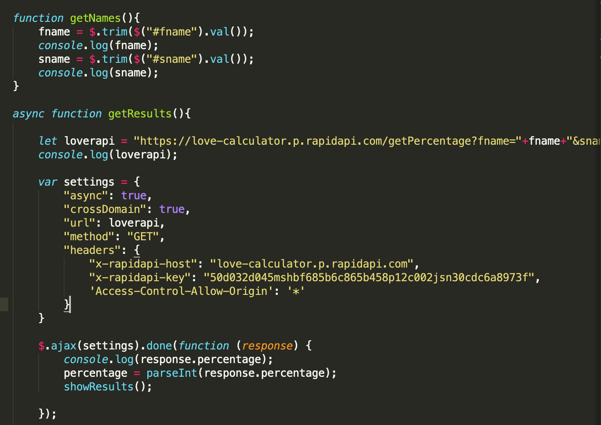
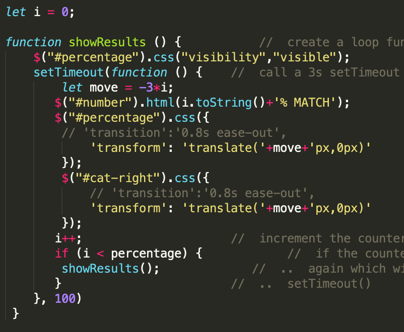

# Love Calculator

Love Calculator calucates the love comcatibility between two names. 
See [LOVE CALCULATOR](https://rebeccazhou666-dwd-hw4.glitch.me/) Here.

Also video demo is here.
[](https://youtu.be/pN4CCRj_4L8)

# About
Love Calculator uses "Love calculator" API to get to know the love compatibility between any first names.
Just simply insert your name and your partner/love/crush’s name and the API calculates the percentage and compatibility result between you two.

# Prerequisites
A text editor or Integrated Development Environment (IDE)- preferably VS Code to view code on your computer if you wish to download.

# Installation
For this particular project, there are no specific installation requirements. Download zip from Github or ```git clone <file-path>``` from command line. 

# Inspiration

I start with searching "interesting API" online ([API](https://english.api.rakuten.net/ajith/api/love-calculator)), and I found this funny "love calculator"<br />
I made a requirement for the website.

1. Contains two inputs, one button.
2. Feedbacks on the web.

It's simple and easy. The only hard thing is how to visualize it creatively.<br />
The first thing came to me is a famous lovers' watch made by Van Cleef & Arpels, which lovers will meet on the center of the bridge at midnight 
This inspires me to make a pair of cat lovers, whose distance demonstrates the love compatibility of these two name.

The sketch is as below.


I didn't draw the wireframe since the structure of the web is super simple. I spent most of the time finding proper illustrations for the website. After browsing tons of resources, I luckily find an interesting gif met my need. 

[walking cat](https://dribbble.com/shots/9893340-Django-the-Cat)

Great! To pair it with a lover, I simply drew a sitting black cat and animated in AE. I encountered lots of obstacles in making transparent gifs. Eg. making transparent gif while removing the previous image at the same place. Finally, I got some free vector illustrations from [freepik](https://www.freepik.com/). Yeah! Materials all set.<br />

The next step is to design hi-fi prototype in sketch. There are two status of the page. When the data is back, there'll be showing as a compatibility percentage and the cat will move accordingly.




# Development

I used```vh vw``` , ```@media``` and also ```normalize.css``` just like my last assignment. 

<h2> API</h2>

When I used API, at first I forgot to sign up into the rapid API website so that the key I got was invalid. After seeing the status 401 code.I realized and signed in and got the right one.<br />
Then I met the problem of CORS. I searched online and solved problem by adding ```'Access-Control-Allow-Origin': '*'``` in ```header```. I annotated the Javascript ```fetch```code in ```main.js``` because I mainly used ```JQuery```to control css (it's neat).

<h2> Supportive Interaction</h2>

There's an animation of result. I used ```setTimeOut``` to make loop function delay so that I can create a number increasing effect.<br />

<h2> Deployment</h2>

Login Glitch.com, create a new project by cloning from Git Repo, and paste the URL to finish.<br /><br />

# Reference
[normalize.css](https://necolas.github.io/normalize.css/)

## Credit to
* [Love Calculator API](https://english.api.rakuten.net/ajith/api/love-calculator)
* [Jendrik Kleefeld] (https://dribbble.com/jokomango)
* [Freepik](https://www.freepik.com/)

## Built with

* [VS Code](https://code.visualstudio.com/)
* [Github](https://github.com)
* [Glitch](https://glitch.com/)

## Author

* [Rebecca Zhou](https://rebeccazhou.net) 

